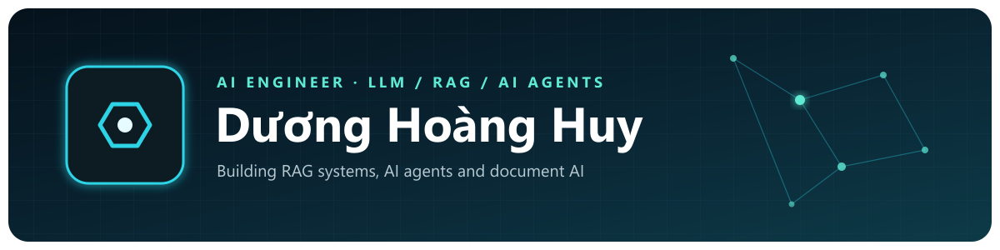

  

  
  
  

# Dương Hoàng Huy

AI Engineer at **AETHER NOVA AI** and Software Engineering student at Industrial University of Ho Chi Minh City (GPA 3.73/4.00).

I build LLM applications end to end: document ingestion, chunking and embedding, vector and hybrid search, reranking, agent orchestration with tool calling, prompt evaluation, and the guardrails, tracing and cost control needed to run them in production. Before AI, I built backend systems with Java / Spring Boot, microservices and CI/CD.

---

### Tech Stack

- **LLM & AI Agents**: pydantic-ai, Pydantic Graph, Spring AI, LLM APIs (OpenAI, Gemini, Anthropic), Function/Tool Calling, Structured Output, Prompt Engineering
- **RAG & Retrieval**: Document Ingestion, Chunking Strategy, Embedding Models, Qdrant, pgvector, Hybrid Search (BM25 + Vector, RRF), Reranking, Metadata Filtering
- **Document AI**: OCR (PaddleOCR, Tesseract, Google Vision), Vision LLM, PP-OCR Fine-tuning, OCR Benchmark (Exact Match, CER/WER)
- **AI Safety & LLM Ops**: Prompt Injection Mitigation, Sensitive Data Redaction, Access Control, Tracing & Logging, Token Budget & Cost Tracking
- **Backend**: Python, FastAPI, Celery, Java, Spring Boot, Spring Cloud Gateway, Spring Security
- **Databases**: PostgreSQL, MySQL, MongoDB, Redis
- **Cloud & DevOps**: Docker, Kubernetes, Jenkins CI/CD, AWS, MinIO, Kafka & RabbitMQ
- **Frontend**: React, Next.js, TypeScript, React Native

---

### Experience

**AETHER NOVA AI Co., Ltd. – AI Engineer** · Oct 2025 – Present
*LISA AI – AI Visa Assistant & Document OCR Extraction*
- Fixed **111 prompt bugs** in the LLM agent and document extraction, re-evaluating output quality after each fix
- Benchmarked local OCR models (PaddleOCR, PP-StructureV3, PaddleOCR-VL, Tesseract) against Google Vision on accuracy, latency and concurrency
- Built an OCR precheck stage that rejects invalid files before running OCR or Vision LLM
- Prepared Vietnamese datasets, fine-tuned PP-OCRv5 recognition and evaluated it against the base model

**Beeyond – Software Engineer Intern** · Jul 2025 – Sep 2025
*AFARM – Smart Farm Management ERP* · `Spring Boot` • `PostgreSQL` • `JaVers` • `React`

---

### Featured Projects

#### [UniSage – AI Academic Assistant (Agentic RAG)](https://bhub.id.vn/projects/unisage) · Graduation Thesis
An AI assistant that answers students' academic questions from the university documents they are allowed to read, with citations.

`FastAPI` • `pydantic-ai` • `Pydantic Graph` • `Qdrant` • `PostgreSQL` • `Redis` • `Celery` • `Spring Boot` • `React`

- RAG pipeline for PDF, Word and Excel: parsing, chunking, embedding and Qdrant indexing with Celery
- Each chunk embedded three ways (content, summary, sample questions) to raise retrieval recall
- Agent graph with intent routing, query rewriting, reranking and web-search tool calling
- Document-level access control, prompt injection detection, multi-LLM failover and token cost tracking
- **Repositories**: [AI Agent](https://github.com/IUH-UniSage/unisage-agent) · [Backend](https://github.com/IUH-UniSage/unisage-backend) · [API Gateway](https://github.com/IUH-UniSage/unisage-gateway) · [Web](https://github.com/IUH-UniSage/unisage-web)

#### [Document OCR – Card Core (LISA AI)](https://bhub.id.vn/projects/document-ocr) · AETHER NOVA AI
Document extraction service behind LISA AI, a visa assistant: turns Vietnamese passports, ID cards, contracts, bank statements and tickets into structured, validated fields.

`FastAPI` • `TaskIQ` • `Redis` • `PaddleOCR` • `PP-StructureV3` • `Tesseract` • `Google Vision` • `pydantic-ai` • `Vision LLM`

- **Extraction for 39 document types**: OCR → quality gate → regex/checksum/MRZ rules → Vision LLM only for missing fields; every field returns source, confidence, validation result and a bounding box
- **Precheck**: rejects blank, too small or over-budget files before a job is created, so no OCR or LLM cost is wasted
- **Benchmark**: accuracy (Exact Match, CER/WER), latency and concurrency of local OCR engines vs Google Vision on clear, scanned, skewed, blurred and glare images, used to pick the engine per document type
- **Test & Eval**: ground-truth test sets, test runs and bulk tests in a QA web app with bbox overlay, plus a regression CLI that catches quality drops after each prompt or model change
- **Fine-tuning**: Vietnamese dataset preparation and PP-OCRv5 recognition fine-tuning, evaluated against the base model
- **Prompt quality**: fixed 111 prompt bugs, re-evaluating output after each fix
- *Private repository (company project)*

#### [Mediahub – Messaging Platform](https://github.com/hoanghuy04/Mediahub)
A real-time messaging platform built as microservices, deployed on Kubernetes through Jenkins CI/CD.

`Spring Boot` • `React` • `React Native` • `Kubernetes` • `Jenkins` • `MongoDB` • `Redis`

#### [Smart Farm Management Platform](https://github.com/hoanghuy04/farm-management)
An agricultural management system for cultivation cycles, assets, task dispatching and real-time operations.

`Spring Boot` • `React` • `PostgreSQL` • `WebSocket` • `AWS S3` • `Javers`

---

### Currently Working On

- Hybrid search (BM25 + vector) with Reciprocal Rank Fusion
- Cross-encoder reranking for higher answer precision
- RAG and OCR evaluation sets to measure every prompt or model change

**Keep Learning • Keep Building • Keep Growing**
